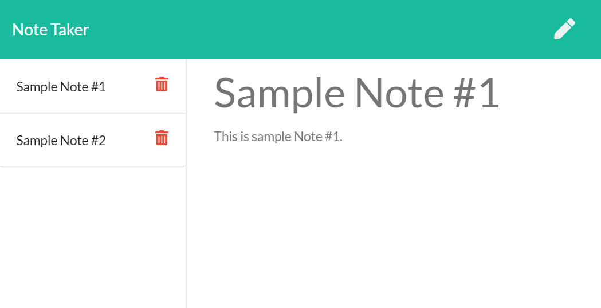

# express-notetaker-9

  

  ## Description:

  Note taking app using a .json database file to store persistent notes, demonstrating GET, POST, and DELETE functionality and routing. Deployed to Heroku.

[Link to Deployed Application](https://peaceful-reaches-00284.herokuapp.com/)

[Link to GitHub Repo](https://github.com/GAFelton/express-notetaker-9)

  

  ## Table of Contents

 * [Installation](#Installation)
 * [Usage](#Usage)
 * [License](#License)
 * [Contributing](#Contributing)
 * [Questions](#Questions)

  

  ## Installation

1. Fork the repo
2. clone it
3. run `npm install`
4.  then start the server with `node server.js`.

  

  ## Usage

  From the app, click through to notetaking, and either write new notes with the 'write' icon, save notes with 'save' (appears once you have text in both the 'Note Title', and 'Note Text' fields,) or delete an existing note with the 'delete' icon.

  ## License

  MIT

  

  ## Contribution Guidelines

  Pull requests are welcome!

  

  ## Questions

  Please address questions to GAFelton.

  [Link to Profile](https://github.com/GAFelton)

  [E-mail](mailto:64555318+GAFelton@users.noreply.github.com)

  
